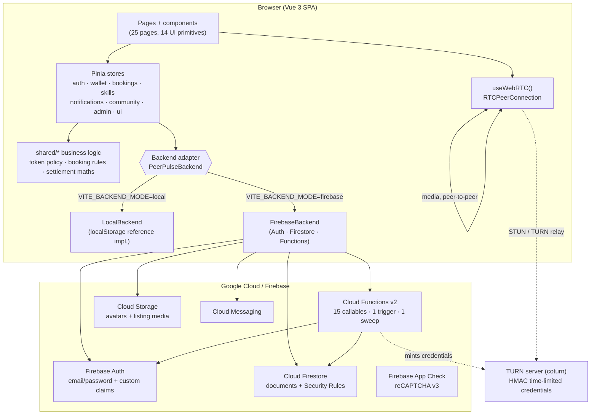
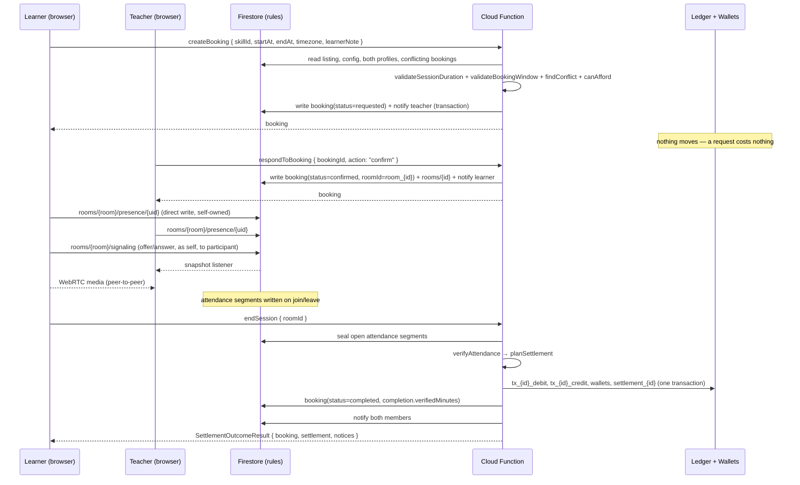
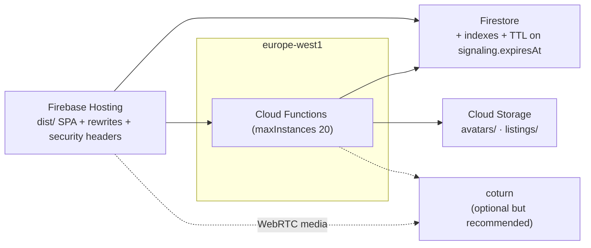

# PeerPulse — System Architecture

> **Deliverable 2 of 11.** How the pieces fit together, where the trust boundaries are, and what happens on
> the wire for the two flows that matter most: a settlement and a call.

---

## 1. Context



---

## 2. Layers and their responsibilities

| Layer | Location | Responsibility | Must never |
| --- | --- | --- | --- |
| Presentation | `src/pages`, `src/components` | Render state, capture intent, show honest empty/error states | Contain business rules or write to the database directly |
| State | `src/stores` | Cache, subscriptions, action orchestration, optimistic-free UI state | Re-implement policy; it calls the adapter |
| Business rules | `shared/*` | Token policy, conflict detection, attendance verification, settlement planning, ledger ids | Depend on Vue, the DOM, Firebase or the browser |
| Backend contract | `src/lib/backend/types.ts` | One interface, two implementations | Leak Firebase types into the app |
| Reference backend | `src/lib/backend/local/*` | Run the product offline, cross-tab, deterministically | Be presented as production storage |
| Production backend | `src/lib/backend/firebase/*` | Rule-governed reads, callable writes, Timestamp ⇄ ISO at the boundary | Move tokens from the client |
| Server authority | `functions/*` | Bookings lifecycle, settlement, moderation, policy, roles, TURN minting | Duplicate the domain maths (it imports `shared/`) |
| Media | `src/composables/useWebRTC.ts` | One peer connection, glare-free negotiation, presence/attendance heartbeat | Store media anywhere |

The single most important structural decision: **`shared/*` is the only source of business logic.** The
browser uses it to preview costs and refuse obviously invalid input; the Cloud Functions use it to decide what
actually happens. The client is a convenience, never the authority. `scripts/sync-shared.mjs` mirrors the
modules into `functions/src/shared/` (the functions package must be self-contained for `firebase deploy`) and
`npm run check:shared` fails on drift.

---

## 3. Trust boundaries

```
┌──────────────────────────── untrusted ─────────────────────────────┐
│ browser: every value it sends, including uids, amounts and claims  │
└───────────────┬────────────────────────────────────────────────────┘
                │  (1) reads  → Security Rules decide
                │  (2) writes → Security Rules decide (small allow-list)
                │  (3) callables → functions re-derive everything
┌───────────────▼────────────────────────────────────────────────────┐
│ trusted: Firestore rules + Cloud Functions (Admin SDK)             │
│  • the only code that can write wallets, ledger, settlements       │
│  • the only code that can grant the admin claim                    │
│  • the only code that can close a room or settle a session         │
└────────────────────────────────────────────────────────────────────┘
```

- **Claim-based administration.** `request.auth.token.admin` is written exclusively by `setUserRole`
  (`getAuth().setCustomUserClaims`). Rules and functions read the claim; profiles store `role` only for
  display.
- **Server-derived identity.** Callables never trust a uid in the payload; they use `request.auth.uid`. The
  client adapter passes `{ bookingId, action }`, never “who I am”.
- **Server-derived money.** `tokenAmount` is always recomputed from the duration via `computeTokenAmount`,
  never accepted from the client.
- **App Check** is initialised when a reCAPTCHA site key is configured (debug tokens supported), so Firestore
  and Functions requests carry an attestation.

---

## 4. Flow: requesting, running and settling a session



Failure paths are explicit: insufficient attendance blocks with
`insufficient_verified_attendance` and prompts a confirmation; an unaffordable learner settles `partial`
(floored to the rounding increment) or blocks with `insufficient_balance`; an already-settled booking returns
its existing record with a notice and moves nothing.

---

## 5. Flow: a WebRTC session

```mermaid
sequenceDiagram
  participant A as Member A (lower uid — offerer)
  participant FS as Firestore
  participant B as Member B (answerer)

  A->>FS: presence(A) — heartbeat every 10 s
  B->>FS: presence(B)
  A->>A: getUserMedia, addTrack, createOffer, setLocalDescription
  A->>FS: signaling { kind: offer, sequence: n, sdp, to: B }
  FS-->>B: snapshot
  B->>B: setRemoteDescription, createAnswer, setLocalDescription
  B->>FS: signaling { kind: answer, sequence: n, sdp, to: A }
  FS-->>A: snapshot
  par ICE
    A->>FS: candidates { to: B } (queued until remote description exists)
    FS-->>B: snapshot
    B->>FS: candidates { to: A }
    FS-->>A: snapshot
  end
  Note over A,B: media flows peer-to-peer; TURN relays only when a direct path fails
  A->>FS: signaling { kind: bye } and presence.leftAt
  B->>FS: presence.leftAt
```

Details — glare handling, sequence numbers, renegotiation, screen share and the fallback when a camera is
refused — are in **[webrtc-signaling.md](./webrtc-signaling.md)**.

---

## 6. Deployment topology



- One region (`europe-west1`) for functions, matching `VITE_FUNCTIONS_REGION` and `setGlobalOptions`.
- Firestore composite indexes live in `firestore.indexes.json`; a TTL policy expires signalling documents.
- Hosting serves the SPA with a rewrite to `index.html`, immutable hashed assets and security headers
  including a `Permissions-Policy` that allows camera/microphone/display-capture only to the app's own origin.
- TURN is optional at deploy time: without `TURN_URLS`/`TURN_STATIC_AUTH_SECRET` the call still runs on STUN,
  and the app says so rather than pretending.

---

## 7. Data-flow invariants (checked in review and tests)

1. **Token conservation** — for any settlement, `sum(debits) == sum(credits)`; the platform never mints.
2. **Idempotency** — ledger ids are derived from the booking id, so a retried settlement overwrites nothing.
3. **Monotonic evidence** — attendance segments can only be closed, never extended
   (`tests/rules/firestore.rules.spec.ts` asserts it).
4. **Participant-only rooms** — every room read, presence write and signalling write is gated on
   `participants` containing the caller.
5. **No client-authored money** — no rule path writes `wallets`, `tokenTransactions` or `settlements`.
6. **Auditability** — every ledger row names its actor (`createdBy`), its reason and its policy code.

---

## 8. Why this shape

- **The adapter pattern** lets the product be demonstrated and unit-tested without a cloud project while the
  production path stays Firebase-native. Both implementations satisfy the same TypeScript interface, so a
  store cannot accidentally depend on one of them.
- **Business logic outside Vue** means the same functions that price a session in the browser decide its
  outcome on the server — the two can be compared in tests instead of argued about in review.
- **Firestore-native signalling** avoids running and paying for a signalling server, at the cost of latency
  (sub-second in-region) and the need for TTL cleanup — an acceptable trade for two-participant sessions.
- **Callables over client writes** keep the write surface small enough to state exhaustively in the rules
  file, which is what makes the “no client moves a token” claim checkable.
