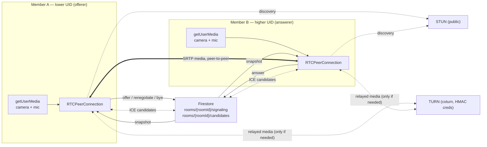
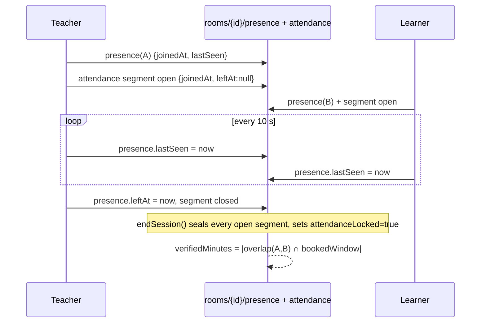

# PeerPulse — WebRTC Signalling Architecture

> **Deliverable 4 of 11.** How two browsers find each other, negotiate media and stay in sync — using
> Firestore as the signalling channel, with no signalling server to run. Written against the implementation
> in `src/composables/useWebRTC.ts` and `functions/src/rooms.ts`.

---

## 1. Why Firestore signalling here

A room in PeerPulse is exactly two people who already have a Firestore document in common (`rooms/{roomId}`)
that both can read and nobody else can. That document subtree is a perfectly good signalling channel:

| Criterion | Assessment |
| --- | --- |
| Latency | ~100–300 ms in-region for a document to appear in a snapshot listener. Three round trips are needed for a call setup, i.e. under a second extra. |
| Scale | Fine for 1:1 sessions. Not suitable for large group calls (an SFU would be required). |
| Cost | One listener per participant plus a handful of tiny documents; TTL deletes them the next day. |
| Security | The same participant gate that protects the room protects its signalling — no separate auth model. |
| Ops | Nothing to host, patch, scale or expose. No TURN-style credential to leak from the signalling tier. |

The trade-off is explicit: we accept higher call-setup latency and a Firestore dependency for media
negotiation, in exchange for removing an entire server from the system.

---

## 2. Topology



**Signalling path:** Firestore documents. **Media path:** direct SRTP between peers, falling back to TURN
relay. **Never:** media through Firestore, Cloud Functions or Hosting.

---

## 3. Roles, sequences and glare

Two decisions remove almost all WebRTC race conditions:

1. **Deterministic offerer.** The participant whose Firebase UID sorts lower is the offerer
   (`selfUid < peerUid`). Both devices compute this identically without a handshake, so “who sends the offer”
   is never ambiguous.
2. **Monotonic sequence numbers.** Every envelope carries a per-sender `sequence` that increments on each
   send. A receiver ignores anything it cannot place in its own timeline, so duplicate deliveries (Firestore
   can redeliver on reconnect) and stale offers are harmless.

Glare is still possible if both sides call `onnegotiationneeded` at once (e.g. both enable a camera in the
same second):

```ts
if (peer.signalingState === 'have-local-offer' && isOfferer()) return          // offerer keeps its offer
if (peer.signalingState === 'have-local-offer') {                              // answerer yields
  await peer.setLocalDescription({ type: 'rollback' })
}
await peer.setRemoteDescription({ type: 'offer', sdp: message.sdp })
```

The non-offerer rolls back its own local offer and answers the incoming one; the offerer ignores the
competing offer. The non-offerer that wants to add a track sends `renegotiate` instead of an offer, asking
the offerer to start the exchange — so a track addition is never the cause of glare.

---

## 4. The envelopes

### 4.1 `rooms/{roomId}/signaling/{messageId}`

```jsonc
{
  "id": "msg_4f21a",
  "kind": "offer",                  // offer | answer | renegotiate | bye
  "from": "demo_lena",              // rules: must equal request.auth.uid
  "to": "demo_sam",                 // rules: must be the other participant
  "sdp": "v=0\r\no=- 46117317 2 IN IP4 127.0.0.1\r\ns=-\r\nt=0 0\r\na=group:BUNDLE 0 1\r\n…",
  "sequence": 3,
  "createdAt": "2026-03-04T17:58:44.120Z",
  "expiresAt": "2026-03-05T17:58:44.120Z"   // Firestore TTL policy deletes it
}
```

- `kind: "bye"` carries no SDP; it is written when a member leaves deliberately so the peer can show
  “the other member left” instead of waiting for an ICE timeout.
- `sdp` is the raw session description. Trickle ICE keeps the SDP small; candidates travel separately.

### 4.2 `rooms/{roomId}/candidates/{candidateId}`

```jsonc
{
  "id": "cand_9b2",
  "from": "demo_lena",
  "to": "demo_sam",
  "candidate": {
    "candidate": "candidate:842163049 1 udp 1677729535 203.0.113.7 55061 typ srflx raddr 0.0.0.0 rport 0 generation 0 ufrag 4fZ network-cost 999",
    "sdpMid": "0",
    "sdpMLineIndex": 0,
    "usernameFragment": "4fZ"
  },
  "createdAt": "2026-03-04T17:58:45.006Z",
  "expiresAt": "2026-03-05T17:58:45.006Z"
}
```

Candidates are **not** trusted to arrive after the description: `handleCandidate()` queues them and
`flushCandidates()` replays the queue the moment the remote description is set. A candidate that fails to
apply is ignored — ICE will find another path.

---

## 5. Call setup, step by step

| # | Actor | Action | Failure mode handled |
| --- | --- | --- | --- |
| 1 | either | `getUserMedia({ video: 720p, audio: echoCancellation })` | Permission blocked → clear message per `DOMException.name`; the session continues audio-less or video-less rather than failing |
| 2 | either | `registerPresence(roomId, uid, media)` | Room not open / not a participant → the backend refuses and the UI stops |
| 3 | either | `watchSignals` / `watchCandidates` / `watchPresence` listeners attached | Cleaned up in `onBeforeUnmount` |
| 4 | offerer | `getIceServers()`, create `RTCPeerConnection`, `addTrack` for each local track | TURN missing → STUN-only configuration, `turnConfigured: false` surfaced in the UI |
| 5 | offerer | `createOffer` → `setLocalDescription` → write `offer(sequence = n)` | |
| 6 | answerer | receives offer → rollback if needed → `setRemoteDescription` → `createAnswer` → `setLocalDescription` → write `answer` | |
| 7 | both | ICE candidates stream into `candidates` as they are gathered | Candidates arriving early are queued |
| 8 | both | `ontrack` fires → remote stream rendered; connection state drives the status pill | `disconnected` → “reconnecting”; `failed` → actionable message |
| 9 | either | toggles camera/mic → `track.enabled`, presence `media` updated | Peer sees the peer’s media state as icons, not as a frozen frame |
| 10 | either | screen share → `getDisplayMedia` → `replaceTrack` on the video sender | Stopping the share restores the camera track; the SDP is renegotiated via the `renegotiate` envelope |

Sequence in the happy path:

```
A: offer(1) ──▶ Firestore ──▶ B
B: answer(2) ─▶ Firestore ──▶ A
A: cand… ─────▶ Firestore ──▶ B
B: cand… ─────▶ Firestore ──▶ A
   ═════════════ media (SRTP) ═════════════
A: bye(3) ────▶ Firestore ──▶ B   (or presence.leftAt)
```

---

## 6. Presence, attendance and settlement

The presence heartbeat does double duty:

- **Liveness:** `rooms/{roomId}/presence/{uid}` is refreshed every **10 seconds** with `lastSeen`. The peer's
  presence matters: if `lastSeen` is older than the stale threshold or `leftAt` is set, the UI shows
  “waiting for the other member” rather than a black screen.
- **Evidence:** on join, an `attendance` segment is opened; on leave (or when `endSession` seals the room) it
  is closed with `leftAt`. **Settlement is computed from these segments**, not from what anyone claims:
  `verifiedMinutes` is the overlap of the two members' segments clamped to the booked window. Because the
  rules forbid reopening a closed segment, presence cannot be back-dated after a session ends.



Ending the session is deliberate: **“Leave quietly”** drops only your own connection (the peer keeps waiting);
**“End session for both”** calls `endSession`, which seals attendance, closes the room and triggers
settlement. Only the two participants can call it.

---

## 7. ICE: STUN, TURN and honest degradation

`getIceServers()` asks the backend for a fresh configuration:

**With TURN configured** (`TURN_URLS` + `TURN_STATIC_AUTH_SECRET` set on the functions runtime):

```jsonc
{
  "iceServers": [
    { "urls": "stun:stun.l.google.com:19302" },
    { "urls": ["turn:turn.example.com:3478?transport=udp", "turns:turn.example.com:5349"],
      "username": "1767203900:demo_lena",                 // "<expiry unix seconds>:<uid>"
      "credential": "0Xk8bZ2…=",                          // base64(HMAC-SHA1(secret, username))
      "credentialType": "password" }
  ],
  "expiresAt": "2026-03-04T18:58:44.000Z",
  "ttlSeconds": 3600,
  "turnConfigured": true
}
```

This is the **coturn REST API** scheme: the static secret never leaves the server, the username is an expiry
timestamp bound to the caller's uid, and the credential is an HMAC over it. Credentials are per-session and
rotate hourly, so a leaked log entry is worthless within the hour. The client never sees
`TURN_STATIC_AUTH_SECRET`.

**Without TURN configured** the function returns STUN servers and `turnConfigured: false`. The call still
works for most peer pairs (direct host/srflx connectivity), and the UI states that relayed connectivity is
unavailable rather than pretending symmetric-NAT users are covered. Set `TURN_URLS` and
`TURN_STATIC_AUTH_SECRET` before inviting members on restrictive networks.

Recommended coturn settings for this scheme:

```conf
# /etc/turnserver.conf (excerpt)
use-auth-secret
static-auth-secret=<same value as TURN_STATIC_AUTH_SECRET>
realm=peerpulse.example.com
no-multicast-peers
no-cli
cert=/etc/letsencrypt/live/turn.example.com/fullchain.pem
pkey=/etc/letsencrypt/live/turn.example.com/privkey.pem
listening-port=3478
tls-listening-port=5349
min-port=49152
max-port=65535
```

---

## 8. Screen sharing and renegotiation

Screen share replaces the outgoing video track instead of adding a second video m-line, which keeps the SDP
small and avoids a second renegotiation on stop:

```ts
const display = await navigator.mediaDevices.getDisplayMedia({ video: true })
const track = display.getVideoTracks()[0]
await peer.getSenders().find(s => s.track?.kind === 'video')?.replaceTrack(track)
// stop: replaceTrack(cameraTrack) again
```

`replaceTrack` needs no renegotiation at all when the track kind is unchanged. The `renegotiate` envelope
exists for the cases where the media *shape* changes (e.g. the member joined with no camera and later
enabled one, adding a video m-line). Either side may send it; only the offerer acts on it by producing the
offer, which keeps the single-offerer invariant intact.

---

## 9. Failure handling

| Symptom | Detection | Behaviour |
| --- | --- | --- |
| Camera/mic denied | `NotAllowedError` / `SecurityError` from `getUserMedia` | Explicit message with the fix (“allow permissions, then rejoin”); the room still opens so the member can listen |
| No camera or mic hardware | `NotFoundError` / `OverconstrainedError` | Room opens receive-only |
| Peer not yet present | presence listener | “Waiting for the other member” with the scheduled window shown |
| ICE fails | `connectionState === 'failed'` | “The direct connection failed…” + retry affordance; TURN missing is called out when `turnConfigured: false` |
| Transient drop | `connectionState === 'disconnected'` | `reconnecting` state; ICE usually recovers on its own |
| Peer left deliberately | `bye` envelope or `presence.leftAt` | `peer-left` state, not an error |
| Duplicate/old signalling | `sequence` comparison | Ignored |
| Room closed or membership expired | backend refuses `registerPresence` / `sendSignal` | UI returns the member to the booking with an explanation |

---

## 10. Security analysis

| Threat | Mitigation |
| --- | --- |
| A third member eavesdrops on signalling | Rules require `request.auth.uid in resource.data.participants` for reads and writes of everything under `rooms/{roomId}` |
| A participant forges signalling as the other member | Rules require `request.resource.data.from == request.auth.uid` |
| A participant spams the other's inbox | Rules require `to` to be the other participant; documents are TTL-deleted after 24 h; the room subtree is deleted with the room |
| TURN credentials leak | Minted per caller, bound to an expiry, HMAC-derived, ≤ 1 h validity; the static secret lives only in the functions runtime |
| Media is intercepted | WebRTC mandates DTLS-SRTP; keys are exchanged over the peer connection, never through Firestore |
| Presence is forged to inflate attendance | Attendance segments are self-owned but close-only, and settlement intersects *both* members' segments with the booked window |
| A member re-opens a closed segment after settlement | The rules deny any update that clears `leftAt`; a settled booking is immutable |
| Signalling documents accumulate cost | `expiresAt` + Firestore TTL policy (24 h) |

---

## 11. Local mode: the same flow without Firebase

In `VITE_BACKEND_MODE=local`, `LocalBackend.sendSignal/sendCandidate/watchSignals/watchCandidates` write to
`localStorage` and notify subscribers through a `storage` event plus a 700 ms poll. The envelopes, sequence
numbers, glare rules and presence heartbeat are identical — only the transport differs. This is what makes the
two-tab WebRTC demo (and the room unit tests) possible without a cloud project; see
`docs/testing.md`.

---

## 12. What a reviewer should test by hand (two browser tabs)

1. Sign in as `sam@peerpulse.app` in tab A and `lena@peerpulse.app` in tab B (password `peerpulse`).
2. Open the same confirmed booking in both tabs; join A first — B should see “connected”, and A should see the
   video once B joins. Offer/answer documents appear in the room's `signaling` subtree.
3. Toggle the camera in A: B sees the placeholder, not a frozen frame.
4. Start a screen share in A: B receives the screen; stop it and the camera returns.
5. Block the camera in one tab before joining: the room still opens, with an explanatory message.
6. Reload A mid-call: A re-registers presence, sends a fresh `offer` with a higher sequence, and reconnects
   without B reloading.
7. End the session for both from A: both tabs leave, the booking moves to settlement, and exactly one ledger
   pair is written (check the wallet of both accounts).
